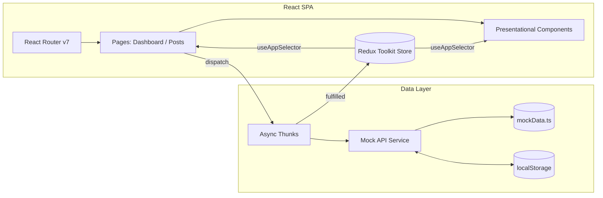

# Social Media Dashboard — Step-by-Step Build Guide

> **Archived: original build playbook.** This document is the original roadmap used to build the Social Media Dashboard. It captures the intended order of work, the architecture decisions, and the acceptance criteria for each step. The codebase may have evolved since this guide was written; for the current setup, architecture, and deployment notes, see [../README.md](../README.md).

---

> **Project Summary:** Social Media Dashboard is a responsive, single-page analytics application for monitoring social media performance across Instagram, Twitter, Facebook, YouTube, and LinkedIn. It provides a dashboard with summary stat cards and trend indicators, multi-platform area and bar charts, per-platform metric cards, a recent-posts feed, and a full posts management page with create/edit/delete, search, platform/status filtering, and sorting. State is centralized with Redux Toolkit using typed hooks and async thunks; data is served from a mock REST API layer with simulated network delays and localStorage-backed persistence for post mutations. The UI is built with Tailwind CSS v4 and shadcn/ui primitives, supports dark/light theming with system-preference detection, and ships with loading skeletons and error/retry states for a production-like UX.

Each step below is a self-contained prompt. Execute them in order.

Stack: React 19, TypeScript 5, Vite 7, Redux Toolkit, React Redux, React Router v7, Tailwind CSS v4, shadcn/ui (Radix-style primitives), Recharts, Lucide React, clsx, tailwind-merge, class-variance-authority, deployed on Netlify.

---

## Table of Contents

**PHASE 1 — Project Foundation**

- STEP 1 — Project Scaffolding & Dependency Setup
- STEP 2 — Tailwind, Global Styles & Path Aliases
- STEP 3 — Domain Types

**PHASE 2 — Data & State Layer**

- STEP 4 — Mock Data
- STEP 5 — Mock API Service Layer
- STEP 6 — Redux Store & Typed Hooks
- STEP 7 — Dashboard Slice
- STEP 8 — Posts Slice

**PHASE 3 — UI Primitives & Shell**

- STEP 9 — UI Primitives (shadcn/ui) & Class Utilities
- STEP 10 — Helpers & Platform Configuration
- STEP 11 — Theme Hook
- STEP 12 — Layout, Sidebar & Header

**PHASE 4 — Feature Pages**

- STEP 13 — Dashboard Components
- STEP 14 — Dashboard Page
- STEP 15 — Posts Components
- STEP 16 — Posts Page
- STEP 17 — Routing & App Entry

**PHASE 5 — Polish & Deploy**

- STEP 18 — Loading, Error & Empty States
- STEP 19 — Persistence & Fetch Deduplication
- STEP 20 — Deployment (Netlify) & Project Documentation

**Appendices**

- Appendix A — Shared Constants
- Appendix B — Reusable Patterns
- Appendix C — Pre-flight Checklist
- Appendix D — Common Pitfalls

---

## Global Build Rules (apply to EVERY step)

- **No git operations.** Do not run `git` commands, do not stage, commit, or push. Version control is handled manually by the user.
- Do not install unapproved packages. Only add a dependency when a step explicitly requires it, and prefer native methods over new dependencies.
- Do not run long-running processes (dev servers, watchers) unless the user requests it.
- Treat every step as self-contained: read the relevant files, make the change, and verify it in isolation.
- Keep code clean, readable, and modern: ES6+, React Hooks, async/await, functional components.
- Use English, descriptive, camelCase identifiers for variables and functions.
- Prioritize performance, security, and accessibility (a11y) in every component.
- Keep components reusable and DRY; extract shared logic into hooks, helpers, or UI primitives.
- Run `npx tsc -b` and resolve linter diagnostics before considering a step complete.

---

## Architecture at a Glance



The application is fully client-side. Pages orchestrate data by dispatching async thunks on mount; thunks call a mock API service that reads seed data from `mockData.ts` and persists post mutations to `localStorage`. Redux Toolkit holds dashboard and posts state, and presentational components read it through typed `useAppSelector` hooks. There is no backend; swapping the mock service for real HTTP calls is the documented path to production.

---

# PHASE 1 — PROJECT FOUNDATION

---

## STEP 1 — Project Scaffolding & Dependency Setup

**Goal:** Stand up a Vite + React + TypeScript project with the runtime and dev dependencies the app needs.

**Files/folders:**

- `package.json`, `vite.config.ts`, `tsconfig.json`, `tsconfig.app.json`, `tsconfig.node.json`
- `index.html`, `src/main.tsx`, `src/vite-env.d.ts`
- `.nvmrc` (pin Node `>=22`)

**Dependencies:**

- Runtime: `react`, `react-dom`, `@reduxjs/toolkit`, `react-redux`, `react-router-dom`, `recharts`, `lucide-react`, `clsx`, `tailwind-merge`, `class-variance-authority`
- Dev: `vite`, `@vitejs/plugin-react`, `typescript`, `@types/react`, `@types/react-dom`, `@types/node`, `tailwindcss`, `@tailwindcss/vite`, `postcss`, `autoprefixer`

**Implementation notes:**

- Use `"type": "module"` and an `engines.node` of `>=22`.
- Scripts: `dev` → `vite`, `build` → `npx tsc -b && vite build`, `preview` → `vite preview`, `lint` → `eslint .`.

**Acceptance:** `npm run dev` serves a blank app on `localhost:5173`; `npx tsc -b` passes.

---

## STEP 2 — Tailwind, Global Styles & Path Aliases

**Goal:** Wire up Tailwind CSS v4 and the `@` path alias so all later imports use `@/...`.

**Files/folders:**

- `vite.config.ts` — register `@vitejs/plugin-react` and `@tailwindcss/vite`; add the alias.
- `src/index.css` — Tailwind entry plus CSS variables for the design tokens and `.dark` overrides.

**Implementation notes:**

- Alias setup:

```ts
import { fileURLToPath, URL } from "node:url";

export default defineConfig({
  plugins: [react(), tailwindcss()],
  resolve: {
    alias: { "@": fileURLToPath(new URL("./src", import.meta.url)) },
  },
});
```

- Define semantic CSS variables (`--background`, `--foreground`, `--primary`, `--destructive`, `--muted-foreground`, etc.) for both `:root` and `.dark`. Components consume these via Tailwind utility classes.

**Acceptance:** A component using `className="bg-background text-foreground"` renders themed colors; `@/` imports resolve in the editor and at build time.

---

## STEP 3 — Domain Types

**Goal:** Centralize all TypeScript contracts so the data, service, and UI layers share one source of truth.

**Files/folders:** `src/types/index.ts`

**Implementation notes:** Define and export:

- `Platform` union: `"instagram" | "twitter" | "facebook" | "youtube" | "linkedin"`.
- `PlatformStats`, `AnalyticsDataPoint`, `Post`, `DashboardSummary`.
- A generic `ApiResponse<T>` wrapper with `data`, `status`, and optional `message`.
- Filter/sort unions: `PostFilter`, `PostStatus`, `SortOrder`.

**Acceptance:** Types compile with no unused-export warnings and are importable as `import type { ... } from "@/types"`.

---

# PHASE 2 — DATA & STATE LAYER

---

## STEP 4 — Mock Data

**Goal:** Provide realistic seed data for stats, analytics, summary, and posts.

**Files/folders:** `src/data/mockData.ts`

**Implementation notes:**

- Export `platformStats: PlatformStats[]`, `weeklyAnalytics` and `monthlyAnalytics` (`AnalyticsDataPoint[]`), `dashboardSummary: DashboardSummary`, and `posts: Post[]`.
- Use plausible numbers (followers in the tens of thousands, engagement 2–6%, impressions in the hundreds of thousands to millions) and varied post statuses (`published`, `scheduled`, `draft`).
- Reference all shapes from `@/types` to keep data and contracts aligned.

**Acceptance:** Imports type-check against `@/types`; data renders sensible values later in charts and cards.

---

## STEP 5 — Mock API Service Layer

**Goal:** Abstract data access behind an async service that mimics a REST API, so the UI never imports mock data directly.

**Files/folders:** `src/services/api.ts`

**Implementation notes:**

- Add a `simulateDelay(ms)` helper and wrap every call in it (300–600ms) for authentic loading UX.
- `dashboardApi`: `getStats()`, `getSummary()`, `getAnalytics(period)` returning `ApiResponse<T>`.
- `postsApi`: `getPosts()`, `getPostById(id)`, `createPost(...)`, `updatePost(id, updates)`, `deletePost(id)`.
- Keep an in-memory `postsStore` hydrated from `localStorage` (falling back to mock data), and persist after every create/update/delete. Use immutable updates (`map`/`filter`), never index mutation.

**Acceptance:** Each method resolves after its delay with a correctly typed `ApiResponse`; post mutations survive a reload.

---

## STEP 6 — Redux Store & Typed Hooks

**Goal:** Configure the store and expose typed dispatch/selector hooks.

**Files/folders:** `src/store/index.ts`

**Implementation notes:**

- `configureStore` with `dashboard` and `posts` reducers.
- Export `RootState`, `AppDispatch`, and `useAppDispatch`/`useAppSelector` via `.withTypes<...>()`.

**Acceptance:** `useAppSelector((s) => s.dashboard)` is fully typed with no `any`.

---

## STEP 7 — Dashboard Slice

**Goal:** Manage dashboard stats, summary, analytics, and the selected period.

**Files/folders:** `src/store/dashboardSlice.ts`

**Implementation notes:**

- State: `stats`, `summary`, `analytics`, `analyticsPeriod`, `loading`, `error`.
- Thunks: `fetchDashboardStats`, `fetchDashboardSummary`, `fetchAnalytics(period)`.
- Handle `pending`/`fulfilled`/`rejected` so all failures surface to `error`.

**Acceptance:** Dispatching the thunks updates state predictably; rejected paths populate `error`.

---

## STEP 8 — Posts Slice

**Goal:** Manage the posts collection plus filter/sort/search UI state and CRUD thunks.

**Files/folders:** `src/store/postsSlice.ts`

**Implementation notes:**

- State: `items`, `loading`, `error`, `filter`, `statusFilter`, `sortOrder`, `searchQuery`.
- Sync reducers: `setFilter`, `setStatusFilter`, `setSortOrder`, `setSearchQuery`.
- Thunks: `fetchPosts`, `createPost`, `updatePost`, `deletePost`, reflecting results into `items`.
- Add a `condition` to `fetchPosts` that skips the request when already loading or already loaded, to avoid redundant fetches across pages.

**Acceptance:** CRUD thunks mutate `items` correctly; navigating between pages does not refetch unnecessarily.

---

# PHASE 3 — UI PRIMITIVES & SHELL

---

## STEP 9 — UI Primitives (shadcn/ui) & Class Utilities

**Goal:** Build the reusable, accessible component primitives the app composes from.

**Files/folders:**

- `src/lib/utils.ts` — `cn()` using `clsx` + `tailwind-merge`.
- `src/components/ui/` — `button`, `card`, `input`, `textarea`, `select`, `dialog`, `badge`, `avatar`, `separator`, `skeleton`.

**Implementation notes:**

- Use `class-variance-authority` for variant-driven components (e.g. `button`, `badge`).
- Ensure focus rings, keyboard interaction, and ARIA attributes for `dialog` and `select`.

**Acceptance:** Each primitive renders with variants and is keyboard-accessible.

---

## STEP 10 — Helpers & Platform Configuration

**Goal:** Centralize formatting utilities and per-platform presentation config.

**Files/folders:** `src/lib/helpers.ts`

**Implementation notes:**

- `formatNumber` (K/M suffixes), `formatPercentage` (signed), `formatDate`, `formatRelativeTime`.
- `platformConfig: Record<Platform, { label; color; bgColor; chartColor }>` — the single place that maps a platform to its label, text/background classes, and chart color.

**Acceptance:** Formatting helpers return expected strings; charts and badges read colors from `platformConfig`.

---

## STEP 11 — Theme Hook

**Goal:** Provide a dark/light theme toggle with persistence and system-preference fallback.

**Files/folders:** `src/hooks/useTheme.ts`

**Implementation notes:**

- Initialize from `localStorage`, else `matchMedia("(prefers-color-scheme: dark)")`.
- On change, toggle the `dark`/`light` class on `document.documentElement` and persist to `localStorage`.
- Return `{ theme, toggleTheme }` with a memoized `toggleTheme`.

**Acceptance:** Toggling updates the UI immediately and the preference survives reloads.

---

## STEP 12 — Layout, Sidebar & Header

**Goal:** Build the responsive app shell with a collapsible sidebar and a header that hosts theme + mobile toggles.

**Files/folders:**

- `src/components/layout/Layout.tsx` — flex shell with `<Outlet />`; owns `sidebarOpen` state and the theme hook.
- `src/components/layout/Sidebar.tsx` — navigation links, off-canvas behavior on mobile.
- `src/components/layout/Header.tsx` — sidebar toggle, theme toggle button.

**Implementation notes:**

- The sidebar is fixed/off-canvas under a breakpoint and static above it; the main area scrolls independently.
- Pass `theme`/`onToggleTheme` and `onToggleSidebar` as props from `Layout`.

**Acceptance:** Layout is responsive; sidebar opens/closes on mobile; theme toggle works from the header.

---

# PHASE 4 — FEATURE PAGES

---

## STEP 13 — Dashboard Components

**Goal:** Build the presentational pieces of the dashboard.

**Files/folders:** `src/components/dashboard/` — `StatsCard`, `PlatformCard`, `AnalyticsChart`, `EngagementChart`, `RecentPosts`.

**Implementation notes:**

- `StatsCard`: icon, title, value (formatted), and a signed change indicator; accept `iconColor`/`iconBg`/`suffix` props.
- `AnalyticsChart`: Recharts area chart with weekly/monthly toggle via an `onPeriodChange` callback.
- `EngagementChart`: Recharts bar chart driven by `PlatformStats[]`.
- `PlatformCard`: per-platform metrics using `platformConfig`.
- `RecentPosts`: compact feed reading the posts slice.

**Acceptance:** Components render purely from props/selectors and use shared formatters and `platformConfig`.

---

## STEP 14 — Dashboard Page

**Goal:** Compose the dashboard and orchestrate data fetching.

**Files/folders:** `src/pages/DashboardPage.tsx`

**Implementation notes:**

- On mount, dispatch `fetchDashboardStats`, `fetchDashboardSummary`, `fetchAnalytics("weekly")`, and `fetchPosts`.
- Render summary `StatsCard`s, the analytics chart, the platform-card grid + engagement chart, and recent posts.
- Provide a `handlePeriodChange` that re-dispatches `fetchAnalytics`.

**Acceptance:** Dashboard populates after the simulated delays and the period toggle refetches analytics.

---

## STEP 15 — Posts Components

**Goal:** Build the posts list card, filter bar, and create/edit dialog.

**Files/folders:** `src/components/posts/` — `PostCard`, `PostFilters`, `CreatePostDialog`.

**Implementation notes:**

- `PostCard`: content, author/avatar, platform badge, status, engagement counts, edit/delete actions.
- `PostFilters`: search input, platform filter, status filter, and sort select — all controlled via callbacks.
- `CreatePostDialog`: shared create/edit form (platform, author, content, optional image); pre-fills when `editingPost` is provided.

**Acceptance:** Filters and the dialog are fully controlled and reusable for both create and edit flows.

---

## STEP 16 — Posts Page

**Goal:** Assemble the posts management experience.

**Files/folders:** `src/pages/PostsPage.tsx`

**Implementation notes:**

- Fetch posts on mount; derive `filteredPosts` with `useMemo` over filter/status/search/sort.
- Wrap handlers in `useCallback`; route create vs. edit through one submit handler based on `editingPost`.
- Show a results count and an empty state when no posts match.

**Acceptance:** Search/filter/sort update the grid efficiently; create/edit/delete reflect immediately.

---

## STEP 17 — Routing & App Entry

**Goal:** Wire routing, the Redux provider, and the entry point.

**Files/folders:** `src/App.tsx`, `src/main.tsx`

**Implementation notes:**

- `App` wraps `BrowserRouter` in the Redux `Provider`; a `Layout` route nests `/dashboard` and `/posts`, with a `*` redirect to `/dashboard`.
- `main.tsx` mounts `<App />` and imports `index.css`.

**Acceptance:** Navigating between routes preserves the shell; unknown paths redirect to the dashboard.

---

# PHASE 5 — POLISH & DEPLOY

---

## STEP 18 — Loading, Error & Empty States

**Goal:** Make async UX feel production-grade.

**Files/folders:** `DashboardPage.tsx`, `PostsPage.tsx`, `src/components/ui/skeleton.tsx`

**Implementation notes:**

- Show skeletons while initial data loads (no summary / empty items).
- Show an error panel with a retry button that re-dispatches the relevant thunks.
- Show an empty state with a call-to-action when filters return nothing.

**Acceptance:** Each async surface has loading, error+retry, and empty variants.

---

## STEP 19 — Persistence & Fetch Deduplication

**Goal:** Persist post mutations and avoid redundant network work.

**Files/folders:** `src/services/api.ts`, `src/store/postsSlice.ts`

**Implementation notes:**

- Hydrate `postsStore` from `localStorage` on load; persist after each mutation inside a `try/catch` (handle unavailable storage / quota).
- Add the `fetchPosts` `condition` guard (skip when loading or already loaded).

**Acceptance:** CRUD changes survive reloads; mounting both pages does not trigger duplicate fetches.

---

## STEP 20 — Deployment (Netlify) & Project Documentation

**Goal:** Prepare for hosting and document the project.

**Files/folders:** `netlify.toml`, `README.md`, `.github/` (issue templates, PR template, `CODE_OF_CONDUCT.md`, `CONTRIBUTING.md`, `SECURITY.md`), `LICENSE`

**Implementation notes:**

- `netlify.toml`: set the build command (`npm run build`), publish dir (`dist`), and an SPA redirect (`/* -> /index.html`, 200) so client routes resolve on refresh.
- Keep `README.md` aligned with the real implementation (features, architecture, data flow, persistence).
- Place community health files under `.github/` so GitHub auto-detects them.

**Acceptance:** `npm run build` produces `dist/`; a deployed SPA serves `/dashboard` and `/posts` directly without 404s on refresh.

---

# Appendix A — Shared Constants

- **Path alias:** `@` → `./src` (configured in `vite.config.ts`). Always import with `@/...`.
- **Platforms:** `instagram`, `twitter`, `facebook`, `youtube`, `linkedin`. To add one, extend the `Platform` union, add a `platformConfig` entry, and seed `mockData.ts`.
- **Simulated delays:** 300–600ms via `simulateDelay`. Keep these for authentic loading UX.
- **localStorage keys:** `theme` (light/dark), `posts` (persisted post store).

---

# Appendix B — Reusable Patterns

**Typed Redux hooks** — always use these instead of the raw hooks:

```ts
export const useAppDispatch = useDispatch.withTypes<AppDispatch>();
export const useAppSelector = useSelector.withTypes<RootState>();
```

**Async thunk with dedup guard:**

```ts
export const fetchPosts = createAsyncThunk(
  "posts/fetchPosts",
  async () => (await postsApi.getPosts()).data,
  {
    condition: (_arg, { getState }) => {
      const { posts } = getState() as RootState;
      return !posts.loading && posts.items.length === 0;
    },
  }
);
```

**Class merge utility:**

```ts
import { clsx, type ClassValue } from "clsx";
import { twMerge } from "tailwind-merge";

export const cn = (...inputs: ClassValue[]) => twMerge(clsx(inputs));
```

---

# Appendix C — Pre-flight Checklist

- [ ] `npx tsc -b` passes with no type errors.
- [ ] `npm run lint` is clean.
- [ ] `npm run build` produces a `dist/` bundle.
- [ ] Dashboard loads stats, summary, analytics, and recent posts after delays.
- [ ] Posts create/edit/delete work and persist across reloads.
- [ ] Search, platform filter, status filter, and sort all work together.
- [ ] Dark/light theme toggles and persists.
- [ ] Layout is responsive; sidebar opens/closes on mobile.
- [ ] Unknown routes redirect to `/dashboard`; deep links resolve on refresh.

---

# Appendix D — Common Pitfalls

- **Importing mock data directly into components.** Always go through `services/api.ts` so the real-API swap stays trivial.
- **Mutating Redux/store arrays in place.** Use immutable `map`/`filter`; in slices rely on Immer via Redux Toolkit.
- **Forgetting the SPA redirect on Netlify.** Without `/* -> /index.html` 200, refreshing `/posts` returns a 404.
- **Duplicate fetches.** Both pages dispatch `fetchPosts`; the thunk `condition` guard prevents redundant calls.
- **localStorage access without guards.** Wrap reads/writes in `try/catch` to survive private mode or quota limits.
- **Hardcoding platform styling.** Read labels and colors from `platformConfig` so adding a platform is a one-file change per layer.

